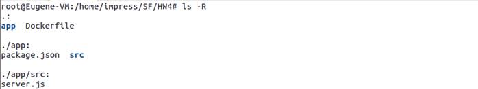
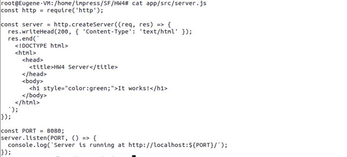
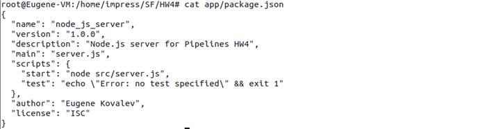
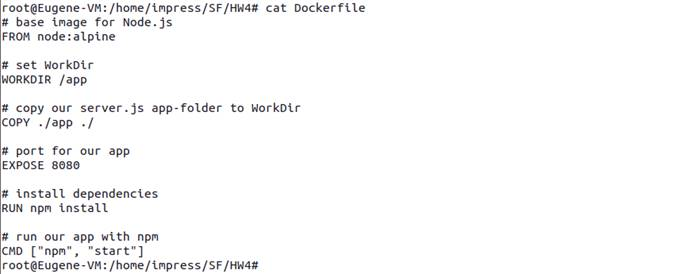
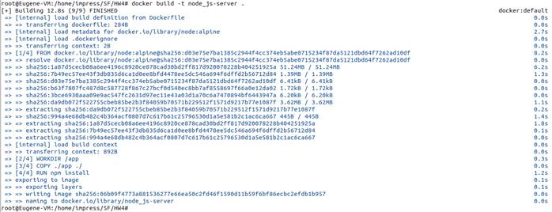
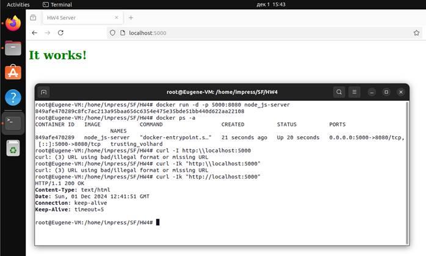

## Практическое задание Docker. Отчет о выполненном задании

### 1. исходный код простого приложения





### 2. содержимое Dockerfile с комментариями



### 3. команду сборки образа

```bash
docker build -t node_js-server .
```



### 4. команду запуска контейнера

```bash
docker run -d -p 5000:8080 node_js-server
```

### 5. ID запущенного контейнера

```bash
root@Eugene-VM:/home/impress/SF/HW4# docker run -d -p 5000:8080 node_js-server
849afe470289c8fc7ac213a95baa656c6354e475e35bde51bb440d622aa22108
```

### 6. вывод списка всех запущенных контейнеров

```bash
root@Eugene-VM:/home/impress/SF/HW4# docker ps -a
CONTAINER ID   IMAGE            COMMAND                  CREATED          STATUS          PORTS                                         NAMES
849afe470289   node_js-server   "docker-entrypoint.s…"   21 seconds ago   Up 20 seconds   0.0.0.0:5000->8080/tcp, [::]:5000->8080/tcp   trusting_volhard
root@Eugene-VM:/home/impress/SF/HW4# curl -Ik "http://localhost:5000"
HTTP/1.1 200 OK
Content-Type: text/html
Date: Sun, 01 Dec 2024 12:41:51 GMT
Connection: keep-alive
Keep-Alive: timeout=5
```

### 7. скриншот работающего приложения в браузере или в командной строке при запуске команды curl


