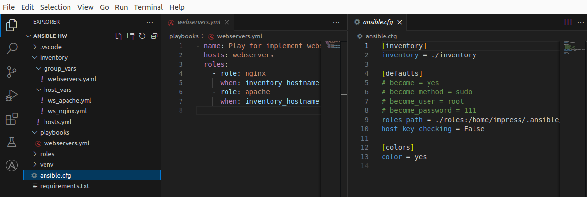

## Практическое задание по Ansible.

**Отчет по автоматизированному развертыванию Nginx + Apache при помощи СУК Ansible**

### 1. Установите Ansible на локальную машину.

(Ansible ставил внутри виртуального окружения Python;  
В качестве удаленного сервера – ВМ в докере[Ubuntu 20, Python 3.12, OpenSSH])

### 2. Подготовьте инвентарный файл для указания IP-адресов удаленных серверов.

### 3. Создайте роли Ansible для установки и настройки:

### 4. Nginx

### 5. Аpache

### 6. Напишите плейбук, который использует созданные роли для развертывания Nginx и Apache на удаленных серверах.

### 7. Выполните плейбук. Убедитесь, что сервисы запущены и работают корректно.

### 8. Проверьте работоспособность развернутых сервисов с помощью браузера или командной строки.

