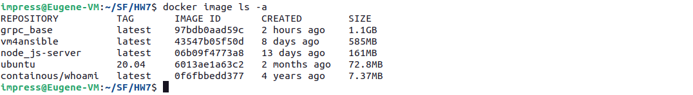

## Практическое задание: проектирование микросервисной архитектуры

**Отчет подготовлен на примере проекта «Система управления задачами», он состоит из трех микросервисов:**

Реализация методов - просто "заглушки", имитация для примера.

#### _Сервис управления пользователями_

Методы:

· RegisterUser — зарегистрировать нового пользователя.

· GetUser — получить пользователя по ID.

#### _Сервис управления задачами_

Методы:

· CreateTask — создать задачу.

· GetTaskStatus — получить статус задачи по ее ID.

#### _Сервис уведомлений_

Методы:

· SendNotification — отправить уведомление пользователю (реализовано просто логирование уведомления в консоль для простоты).

### Архитектура приложения (диаграмма)

### Реализация

Для реализации сервисов был выбран Node.js. Написаны три сервиса и методы в них.

Чтобы работали команды grpcurl или можно было обращаться к сервисам через Postman был добавлен gRPC Reflection API.

Код всех сервисов, .proto файлов, docker-контейнеров, и docker-compose файла, где всё приложение собирается приведен в текущем репозитории.

Т.к. все три контейнера сервисов похожи как 2 капли и отличаются только скриптами самих сервисов, решено было сделать базовый образ grpc_base и на его основании сделать все другие контейнеры.

В контейнерах на базе node:18

1.  ставятся плагины из package.json

    a. @grpc/grpc-js@1.12.4

    b. @grpc/proto-loader@0.7.13

    c. @grpc/reflection@1.0.4

2.  копируются файлы .proto для их автоматической компиляции Node.js

3.  и в каждом отдельном контейнере копируется свой сервис в рабочую директорию

#### Пройдемся по командам сборки приложения:

Собираем базовый образ:

`docker build -f base.Dockerfile -t grpc_base .`

Собираем и запускаем все контейнеры:

`docker compose up -d –build`

#### Приложение готово к тестированию:

У нас сервис нотификации не высылает никаких сообщений, т.к. там просто заглушки методов – он просто логирует в консоль сообщение, которое получает при вызове.

Вызывать мы его будем только когда отрабатывает задание на создание новой Задачи.

Чтобы увидеть это сообщение – в терминале повесим watch на логи контейнера с нотификатором:

Протестируем сначала скриптами (они не требуют работы сервисов с режимом рефлексии).

Скрипт create.js создаст нового пользователя, а потом, получив обратно ID этого нового пользователя – создаст для него новую задачу.

(Этот новый пользователь сохранится в памяти, поэтому мы потом сможем проверить его наличие)

Сразу видим, что у нас отработал сервис нотификаций (была создана новая Задача) и в лог упало сообщение.

Теперь проверим существование пользователей и задач.

У нас есть сохраненный прямо в коде user Admin с ID= u12345678 и Задача с ID= t12345678. Запросим их:

Успешно получены захардкоженные значения.

Теперь запросим у службы пользователей созданного на первом шаге юзера с ID= u1734187100545, а таску запросим несуществующую.

Тоже всё работает.

##### Теперь проверим работу сервисов с использованием grpcurl

Создание пользователя, запрос существующего в коде пользователя, запрос нового пользователя, запрос несуществующего:

Создание задачи, запрос существующей задачи, запрос несуществующей задачи:

Как видно, при создании новой таски у нас снова отработал сервис уведомлений.
