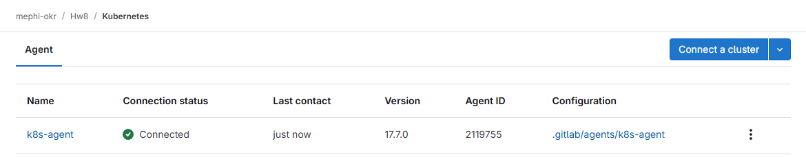
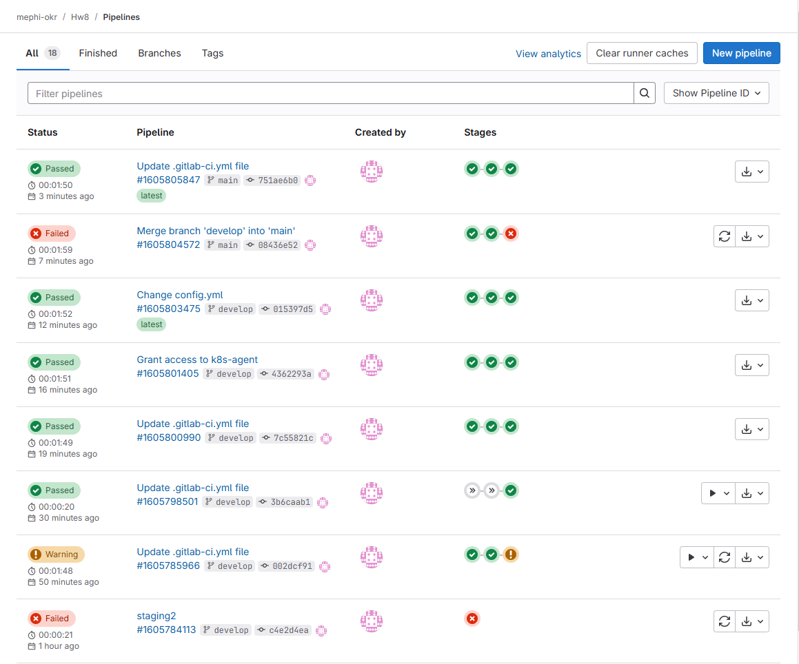

## Отчет по практическому заданию 8. Проектирование микросервисной архитектуры.

**В этом задании создается полноценный CI/CD конвейер с использованием репозитория GitLab, GitLab Container Registry и Kubernetes (minikube).**

### 1. Подготовка окружения.

-   Настройте Kubernetes кластер (Minikube c docker-драйвером)

# Установка Minikube

```
curl -LO https://storage.googleapis.com/minikube/releases/latest/minikube-linux-amd64

sudo install minikube-linux-amd64 /usr/local/bin/minikube
```

# Запуск Minikube

```
minikube start --driver=docker
```


-   Установите и настройте kubectl для управления кластером Kubernetes.

# Установка kubectl

```
curl -LO "https://dl.k8s.io/release/$(curl -L -s https://dl.k8s.io/release/stable.txt)/bin/linux/amd64/kubectl"

sudo install -o root -g root -m 0755 kubectl /usr/local/bin/kubectl
```

# Проверка статуса

```
minikube status

kubectl cluster-info
```


-   Выберите проект, который будете билдить и деплоить в кластер Kubernetes при помощи Gitlab.

_Выбрал самый простой проект на Flask – запускает веб-сервер и выводит на страницу приветствие и текущую дату._

```python
from datetime import datetime
from flask import Flask

app = Flask(__name__)

@app.route("/")
def hello():
	return "<h1>Hello from K8s!</h1><h3>Now: " + str(datetime.now()) + "</h3>"

if __name__ == "__main__":
	app.run(host='0.0.0.0', port=6088)
```

### 2. Установка GitLab Kubernetes Agent.

-   Установите GitLab Kubernetes Agent в ваш Kubernetes кластер. Это позволит GitLab взаимодействовать с вашим кластером напрямую.




### 3. Создание проекта и добавление приложения.

-   См. [код проекта](k8s-hw/).

-   В корне репозитория создайте файл Dockerfile для сборки Docker образа вашего приложения.


### 4. Создание Kubernetes манифестов.

-   См. [код проекта](k8s-hw/).

### 5. Настройка CI/CD конвейера в GitLab.

-   См. [код проекта](k8s-hw/).

-   Определите пайплайн с несколькими стадиями: build, test, deploy_staging, deploy_production.


-   Настройте использование GitLab Kubernetes Agent для деплоя в Kubernetes.


### 6. Сборка Docker-образа.

-   Настройте стадию build, чтобы собирать Docker образ вашего приложения и загружать его в Container Registry.

-   Тегируйте образы в зависимости от ветки (latest для master и специфические теги для других веток).


### 7. Настройка окружений в GitLab.

-   Создайте два окружения в GitLab: staging и production.


-   Настройте условия для стадий deploy_staging и deploy_production, чтобы развертывание происходило в соответствующие окружения в зависимости от ветки (например, развертывание в staging при коммите в ветку develop и в production при мерже в ветку master).


### 8. Развертывание в Kubernetes с использованием GitLab Kubernetes Agent.

-   Настройте стадии deploy_staging и deploy_production для применения Kubernetes манифестов на соответствующие окружения с использованием GitLab Kubernetes Agent.


## Результаты:




